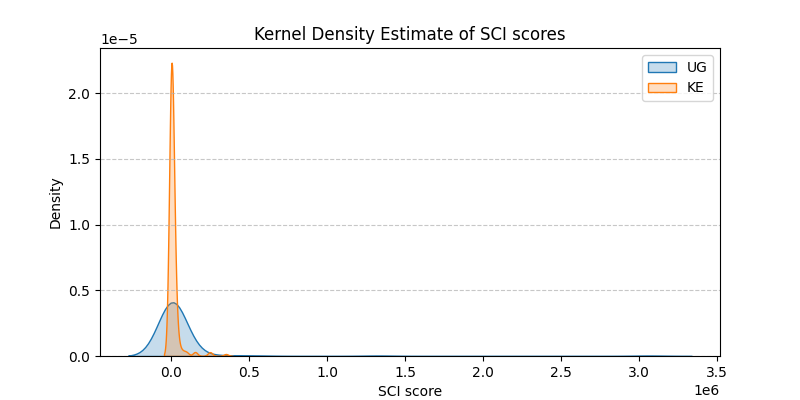

<div align=center>


<br>

A research project submitted as a part of the completion of [Kujenga AI Course](https://kujenga.readthedocs.io/en/latest/index.html).

Authored by Henry Ssenono 

</div>

> [!IMPORTANT]
> 
> *Special thanks to the [course instructors for designing a curriculum](https://github.com/AfricaEuropeCoreAI/Kujenga) that made ideas like PageRank, epidemic modelling, and regression feel not just learnable but genuinely applicable to questions that matter close to home.*

## Research Questions

1. How important is Uganda and Kenya in the African social network as measured by the Facebook Social Connectedness Index?
2. Are Ugandans more socially connected than Kenyans in the global network?

## Dataset

**Facebook Social Connectedness Index (SCI)** was published by Meta Research(AI for Good) and distributed via the Humanitarian Data Exchange (HDX). 
It can be found at https://data.humdata.org/dataset/social-connectedness-index. The country.zip dataset was used, it is included in this repo and can be downloaded here: [country.csv](./data/country.csv)
The dataset contains pairwise SCI scores between countries worldwide. The SCI between two countries is defined as:

$$SCI_{i,j} = \frac{\text{FBfriendships}_{i,j}}{\text{FBusers}_i \times \text{FBusers}_j}$$

FB stands for Facebook.

A higher score means people in those two countries are disproportionately likely to be Facebook friends.

## Methods

The project applies two (2) techniques from the course:

| Question | Technique | Lesson |
|------|-----------|--------|
| 1 | PageRank (iterative method) | Lesson 4 ([link](https://kujenga.readthedocs.io/en/latest/gallery/lesson4/plot_influencer.html?authuser=0)) |
| 2 | Two-sample t-test | Lesson 3 ([link](https://kujenga.readthedocs.io/en/latest/gallery/lesson3/plot_runners.html?authuser=0)) |

### Question 1 (using PageRank algorithm)
The SCI dataset is modelled as a weighted directed graph where countries are nodes and SCI scores are edge weights. 
The PageRank algorithm (damping factor $d=0.85$,  iterative method) is implemented to rank Uganda's and Kenya's importance in the African friendship network accounting not just for how many connections Uganda/Kenya has, but how important those connected countries are.

### Question 2 (using t-test)
Uganda's and Kenya's log-SCI distributions (over common partner countries) are compared using a two-sided, two-sample t-test to determine whether the difference in mean social connectedness is statistically significant.

- $H_0: μ_{UG} = μ_{KE}$
- $H_1: μ_{UG} ≠ μ_{KE}$

## Key Finding

Despite Kenya's greater economic integration in East Africa, the t-test finds no statistically significant difference between Uganda's and Kenya's global social connectedness ($p ≥ 0.05$). The plot below confirms the t-test result.



This suggests that geographic proximity and shared migration corridors matter more than economic size in shaping cross-border friendship networks.

## How to Run

- Run online: [](https://colab.research.google.com/github/keyxyz/social-fabric-of-africa/blob/main/notebooks/sci-for-african-countries.ipynb)
- Run locally:

    ```bash
    # clone repository
    git clone https://github.com/keyxyz/social-fabric-of-africa.git
    cd social-fabric-of-africa

    # create virtual environment
    python -m venv venv
    source venv/bin/activate
    # for windows
    # source venv/Scripts/Activate.bat 

    # install dependencies
    pip install jupyter pandas numpy matplotlib scipy networkx

    # run
    jupyter lab
    ```

## Limitations

- SCI is based on Facebook users only and so populations without internet access are underrepresented which disproportionately affects African countries.
- A null result in the t-test means we cannot detect a difference, not that no difference exists.

## References

- Bailey, M. et al. (2018). *The Social Connectedness Index.* Meta Research.
- Facebook Social Connectedness Index dataset via HDX: https://data.humdata.org/dataset/social-connectedness-index
- Page, L. et al. (1999). *The PageRank Citation Ranking: Bringing Order to the Web.* Stanford InfoLab.
